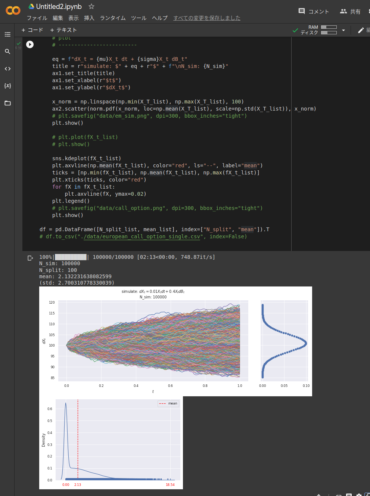

# SimuleEuropeanCallOption

## settings
run with poetry 
```bash
$ poetry install
```

`simulate_euler_maruyama.py` has been cofirmed to work on GoogleColab.  
Copy and paste this code into a single cell and run it.
